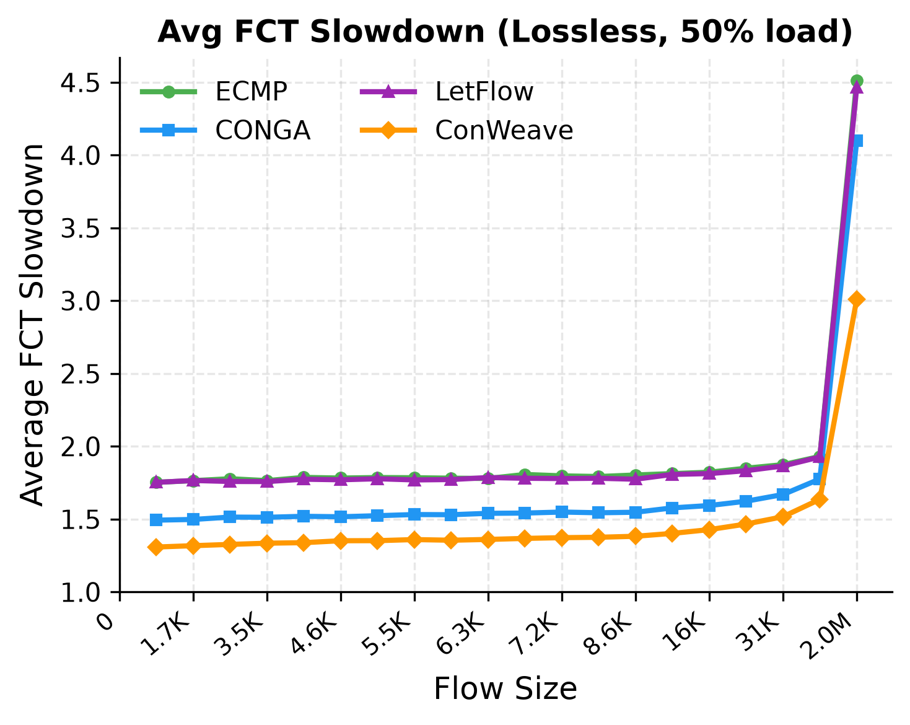
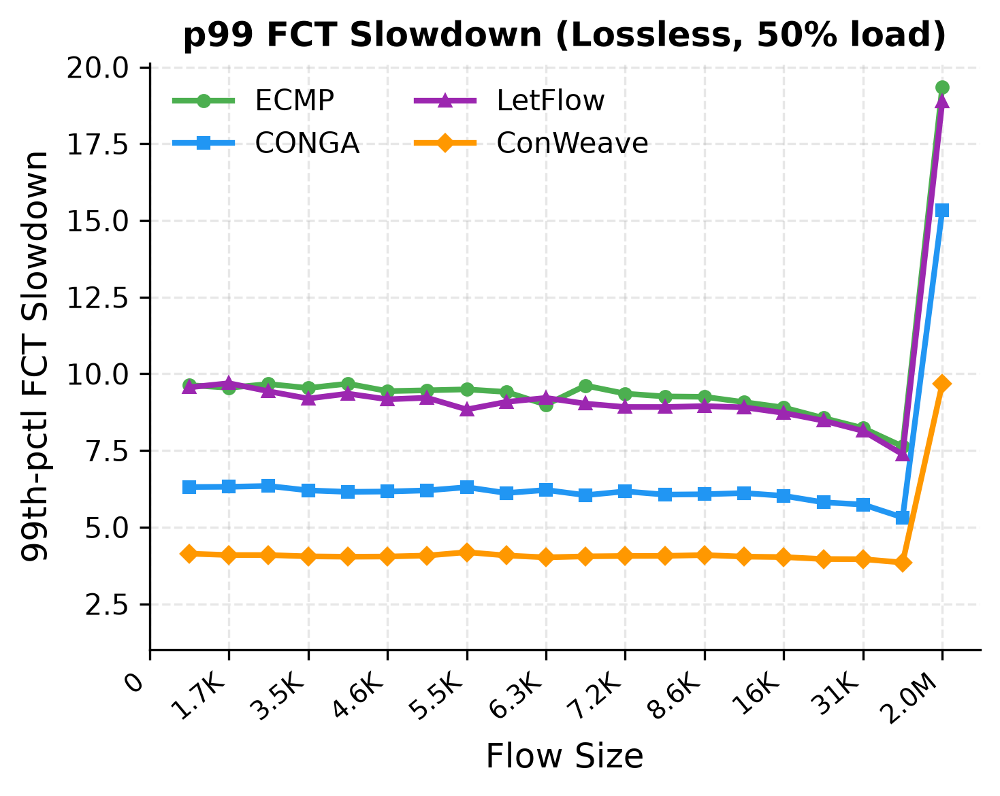
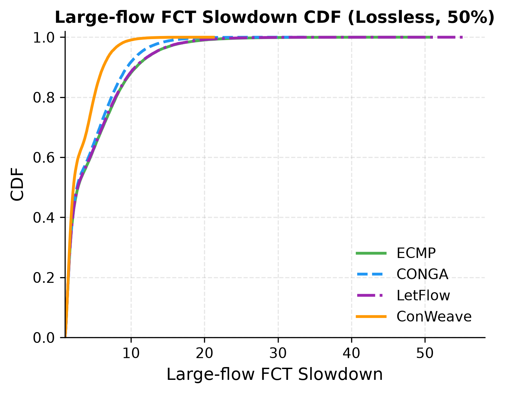
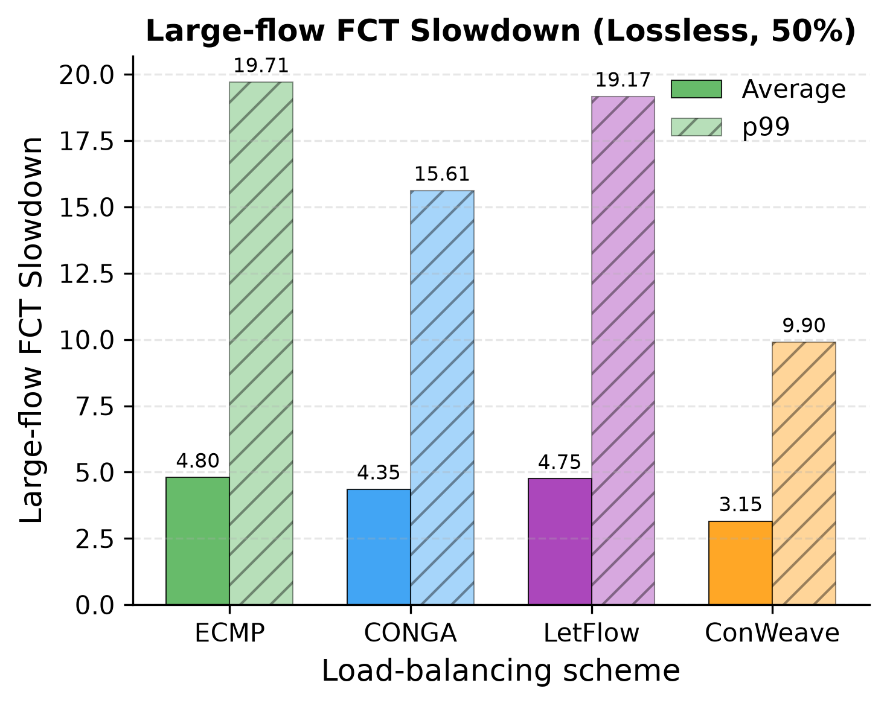
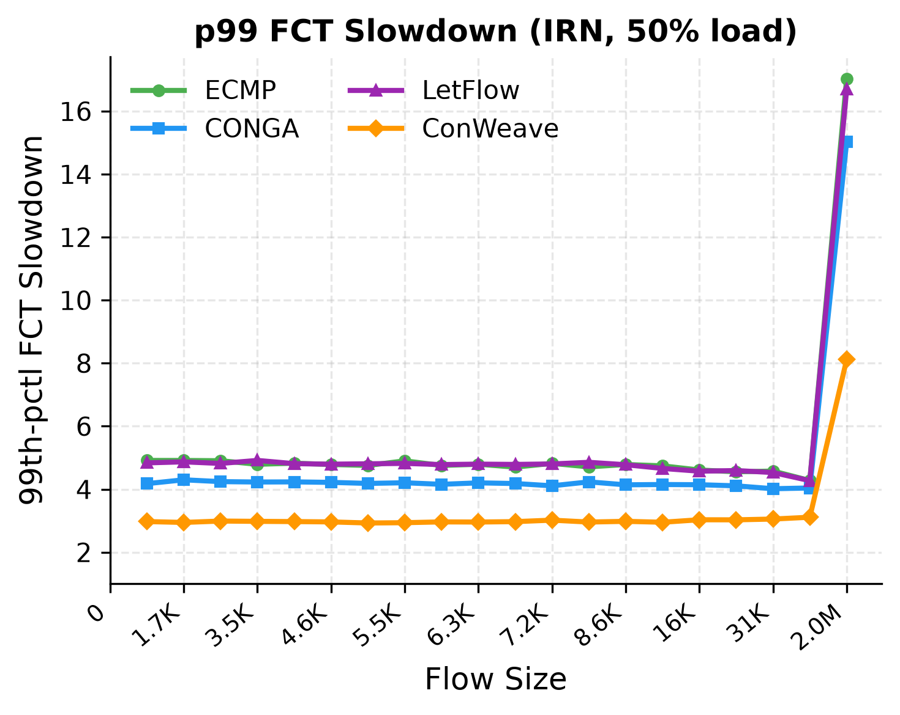
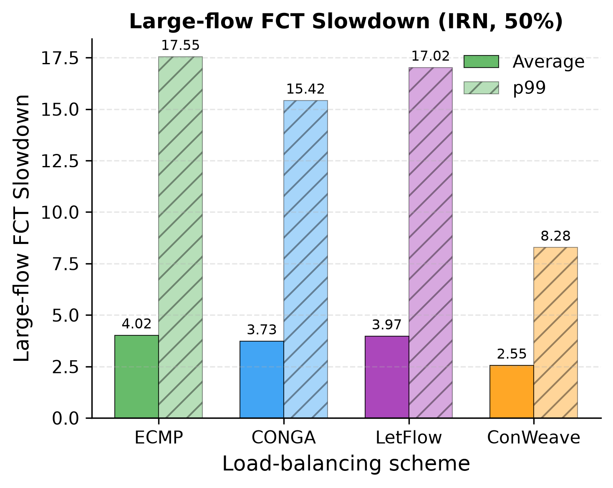
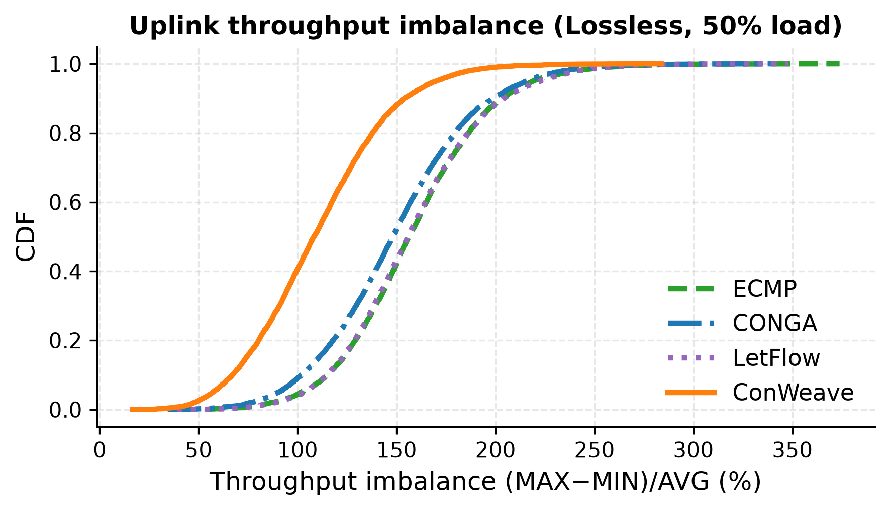
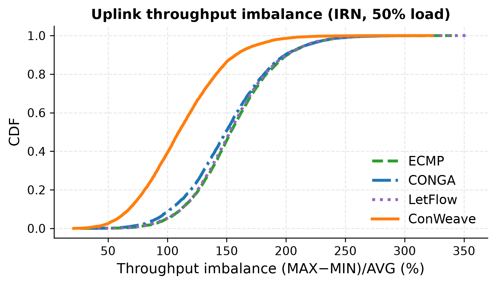

# Replicating: "Network Load Balancing with In-network Reordering Support for RDMA"

**Team Members:**
Luca Bordin (luca1.bordin@mail.polimi.it)
Mattia Menegale (mattia.menegale@polimi.it)
Youssef — (TBD)

---

**Source Paper:**
Cha Hwan Song, Xin Zhe Khooi, Raj Joshi, Inho Choi, Jialin Li, Mun Choon Chan.
*Network Load Balancing with In-network Reordering Support for RDMA.* In
Proceedings of ACM SIGCOMM 2023. https://doi.org/10.1145/3603269.3604849

**Project:**
This repository: https://github.com/lucabord/conweave-reproduction —
report, figures, and the reproduction scripts we wrote on top of the
ConWeave NS-3 artifact (https://github.com/conweave-project/conweave-ns3).

---

# 1. Introduction

**The problem.** RDMA (Remote Direct Memory Access) lets servers transfer data
directly between their memories, bypassing the CPU. It is the standard
transport for storage and machine-learning workloads in modern datacenters.
However, RDMA network cards (RNICs) require packets to arrive **in order**.
RoCEv2 — the most common RDMA transport — uses Go-Back-N error recovery:
a single out-of-order packet causes the receiver to discard everything that
came after it and request a full retransmission, collapsing throughput.

**Why existing load balancers fail.** Datacenter networks have multiple
equal-cost paths between any two servers. Load balancers spread traffic across
these paths to avoid congestion. The simplest approach, ECMP, assigns each
flow to one fixed path — safe for RDMA (no reordering) but creates hot-spots
when multiple large flows share a link. Smarter schemes like CONGA or LetFlow
reroute traffic mid-flow to avoid congestion, but doing so inevitably delivers
some packets out of order — exactly what RDMA cannot handle. Network operators
face a forced trade-off: good load balance or RDMA safety, not both.

**ConWeave's solution.** ConWeave eliminates this trade-off by handling
reordering *inside the network*. It reroutes traffic aggressively for optimal
load balance (like CONGA), but the destination Top-of-Rack (ToR) switch
**reorders packets before delivering them to the RNIC**. Out-of-order packets
are held in per-flow **Virtual Output Queues (VOQs)** and released in the
correct sequence. The source ToR tags each packet with timing metadata and
probes path round-trip times so the destination knows how long to wait.
From the RNIC's perspective, packets always arrive in order — the entire
reordering mechanism is transparent to the application.
ConWeave requires programmable switches (the paper uses Intel Tofino2) and
adds a small header tag per packet.

**Paper's main claims.** (1) Even minimal reordering triggers destructive
behavior in RNICs; (2) ConWeave's VOQ state fits within switch memory limits;
(3) a Tofino2 prototype operates at line rate; and (4) NS-3 simulations show
up to **42.3 %** lower average FCT and **66.8 %** lower 99th-percentile FCT
compared to state-of-the-art load balancers.

**Scope of this report.** We reproduce the NS-3 FCT-slowdown results (Figures
12 and 13), which compare ECMP, CONGA, LetFlow and ConWeave under both
Lossless RDMA and IRN flow control, plus the uplink-imbalance CDF from
Figure 14.

# 2. Selected Result

We reproduce **Figure 12** and **Figure 13** of the paper.

* **Figure 12** shows **FCT slowdown vs flow size** (average and 99th
  percentile) for the load-balancing schemes on a 128-server leaf-spine
  fabric under **Lossless RDMA** (PFC enabled). FCT slowdown = measured
  completion time / ideal completion time on an empty network; 1.0 means no
  overhead. The paper shows 50 % and 80 % load; we reproduce the 50 % panels.
* **Figure 13** shows the same metric under **IRN** flow control (selective
  retransmission instead of Go-Back-N), again at 50 % load.

In addition to these two figures, we analyze **large flows (≥ 1 BDP =
104 KB)** — the flows that hold links longest and suffer most from path
collisions and reordering — reporting their slowdown CDF and per-scheme
summary statistics (average and p99). This breakdown follows the artifact's
analysis scripts and the paper's emphasis on tail behavior, but does not
correspond to a single numbered figure in the paper.

These two figures contain the paper's main performance claim: ConWeave delivers
near-ideal FCT even under heavy load, while staying RDMA-safe. Reproducing
them directly tests whether this claim holds. The reproduced figures are
presented and discussed in §4.1.

# 3. Environment Setup

**Hardware.** Apple M5 (ARM64, 10 cores), 24 GB RAM, single local machine.
Each NS-3 simulation uses approximately 1 CPU core and 1.1 GB of memory.
We run simulations in parallel, capping concurrency at 5–8 jobs depending on
the experiment to stay within memory and thermal limits.

**Software.**
- macOS 26.5.1 (Darwin 25.5.0).
- Docker Desktop 4.79.0 with `ubuntu:20.04` running as `linux/amd64` under
  Rosetta 2 (x86 emulation on Apple Silicon). Docker memory allocated: 16 GB.
- ns-allinone-3.19 with the ConWeave artifact, built with waf (optimized
  profile).
- Post-processing and plotting: Python 3, numpy 2.5.0, matplotlib 3.11.0.

**Simulation parameters.**
- Topology: `leaf_spine_128_100G_OS2` — 128 servers on a 2:1 oversubscribed
  leaf-spine fabric, all links at 100 Gbps.
- Workload: `AliStorage2019` flow-size distribution (real-world datacenter
  trace), Poisson arrivals at **50 % load**.
- Congestion control: DCQCN. Flow control: Lossless (PFC) and IRN (selective
  retransmission), tested separately.
- Simulated time: **0.1 s** of flow generation. The first 5 ms are excluded
  as warm-up; flows must complete within 50 ms after generation stops. Only
  flows that both start and finish within this window are included in the
  analysis.
- Load-balancing schemes: ECMP, CONGA, LetFlow, ConWeave. ConWeave uses the
  artifact defaults: VOQ wait 200 µs, TX expiry 300 µs, path pause 16 µs.
- Switch buffer: 9 MB (the artifact default).

**Differences from the original setup.**

1. **x86 emulation.** The paper ran natively on x86 Linux. We run under
   Rosetta 2, which translates x86 instructions to ARM at runtime. This
   increases wall-clock simulation time by roughly 2–3× but does not affect
   results: NS-3 is fully deterministic for a given random seed.

2. **Parallel execution.** The artifact's `autorun.sh` launches all 8 runs
   simultaneously. We use a parallel pool that limits concurrency to 5–8 jobs
   to stay within Docker's 16 GB allocation. Simulation configurations and
   seeds are unchanged.

3. **0.1 s simulated time.** This is the artifact's default and may be shorter
   than what the paper used. Absolute FCT values may therefore differ; we
   compare *trends and relative improvements* rather than exact numbers.

**Undocumented parameter.** The paper does not state the switch buffer size
used for Figures 12–13. The artifact defaults to 9 MB, and we use this value
for the reproduction.

# 4. Experiment Result

**How a simulation run works.** For each (scheme, flow-control) pair:
(1) `traffic_gen.py` generates a flow arrival trace following the AliStorage
CDF; (2) `run.py` writes a configuration file and launches the NS-3
simulation; (3) `fctAnalysis.py` post-processes the raw output. Our scripts
`reproduce_fig12.py` and `reproduce_fig13.py` then read the processed files
and produce the plots.

**How FCT slowdown is computed.** The NS-3 output records, for each completed
flow: its size, start time, actual completion time, and the *standalone* FCT —
the time the same flow would take on an otherwise empty network. FCT slowdown
= actual FCT / standalone FCT, clamped to a minimum of 1.0. Only flows
starting after warm-up and finishing before cool-down are counted.

**Statistics.** Each simulation uses a fixed random seed (`RANDOM_SEED 1`),
so results are deterministic. Each 0.1 s run completes roughly 930 000 flows,
giving well-populated statistics even for tail metrics like p99. The downside
of a single seed is that we cannot compute confidence intervals across multiple
traffic realizations.

## 4.1 Reproduced Figures and Comparison

The following figures reproduce the paper's Figure 12 (FCT slowdown vs flow
size, Lossless RDMA); the IRN counterpart (paper Figure 13) is shown later in
this section. Figures 2–3 correspond to Figure 12(a)–(b) in the paper;
Figures 4–5 are our additional large-flow (≥ 1 BDP) breakdown.

  

    
    
Figure 1(a) — Paper Figure 12 (original): Avg. and tail FCT slowdown
    for AliStorage in Lossless RDMA, from Song et al., SIGCOMM'23, shown for
    visual comparison.

  

  

    
    
Figure 1(b) — Paper Figure 13 (original): Avg. and tail FCT slowdown
    for AliStorage in IRN RDMA, from Song et al., SIGCOMM'23, shown for
    visual comparison.

  

  

    
    
Figure 2: Average FCT slowdown vs flow size (Lossless RDMA).
    Corresponds to Figure 12(a) in the paper.

  

  

    
    
Figure 3: p99 FCT slowdown vs flow size (Lossless RDMA).
    Corresponds to Figure 12(b) in the paper.

  

  

    
    
Figure 4: Large-flow (≥ 1 BDP) FCT-slowdown CDF (Lossless RDMA).
    Our additional breakdown; no direct paper counterpart.

  

  

    
    
Figure 5: Large-flow avg/p99 slowdown per scheme (Lossless RDMA).
    Our additional breakdown; no direct paper counterpart.

  

*Table 1 — FCT slowdown under Lossless RDMA (50 % load). "All" = every flow;
"Large" = flows ≥ 1 BDP (104 KB). Lower is better; 1.0 is ideal.*

| Scheme | Avg (all) | p99 (all) | Avg (large) | p99 (large) |
|---|:---:|:---:|:---:|:---:|
| ECMP | 1.94 | 10.88 | 4.80 | 19.71 |
| LetFlow | 1.93 | 10.57 | 4.75 | 19.17 |
| CONGA | 1.69 | 8.10 | 4.35 | 15.61 |
| **ConWeave** | **1.47** | **5.35** | **3.15** | **9.90** |
| *ConWeave vs ECMP* | *−24 %* | *−51 %* | *−34 %* | *−50 %* |

ConWeave outperforms every other scheme on all metrics. The gains are largest
at the **99th percentile** (−51 % overall, −50 % on large flows), which is the
metric most relevant to tail-sensitive RDMA workloads.

The scheme ordering matches the paper: ECMP is worst because it keeps each
flow on a single fixed path; CONGA and LetFlow spread traffic better but still
reorder packets; ConWeave reroutes for balance *and* restores order in-network.

Our improvements (−24/−51 %) are smaller than the paper's (−42/−67 %). This is
expected: we simulate 0.1 s of traffic (the artifact default), which likely
corresponds to a shorter effective horizon than the paper used. Trends and
relative ordering are identical — the reproduction is valid.

**IRN flow control.** Under IRN (which replaces Go-Back-N with selective
retransmission), absolute slowdowns decrease for all schemes, since the
transport can recover from reordering without discarding packets. The
performance gaps between schemes narrow, but **ConWeave still leads on every
metric**.

  

    
    
Figure 6: p99 FCT slowdown vs flow size (IRN).
    Corresponds to Figure 13(b) in the paper.

  

  

    
    
Figure 7: Large-flow avg/p99 slowdown per scheme (IRN).
    Our additional breakdown; no direct paper counterpart.

  

Under IRN, large-flow slowdown (avg / p99): ECMP 4.02 / 17.55, LetFlow
3.97 / 17.02, CONGA 3.73 / 15.42, **ConWeave 2.55 / 8.28**. ConWeave
achieves **−36 % average and −53 % p99 vs ECMP** — a clear lead even when
the transport already tolerates reordering.

**Uplink load balance (paper Figure 14).** The FCT gains come from better
traffic spreading, which we can verify directly: for every ToR switch and
every 100 µs window we compute the throughput imbalance across its uplinks,
(MAX−MIN)/AVG, and plot the CDF over all switches and windows
(`scripts/reproduce_fig14.py`, same algorithm as the artifact's
`plot_uplink.py`). This reproduces the uplink-imbalance panel of the paper's
Figure 14; DRILL is omitted because we did not simulate it.

  

    
    
Figure 8: CDF of per-ToR uplink throughput imbalance, Lossless RDMA.
    Corresponds to the uplink-imbalance panel of Figure 14 in the paper.

  

  

    
    
Figure 9: Same metric under IRN flow control.

  

ConWeave spreads traffic markedly better than every alternative: its median
imbalance is 108 % (Lossless) / 110 % (IRN) versus 148–156 % for ECMP, CONGA
and LetFlow, and the gap persists at the tail (p99 200–207 % vs 248–257 %).
ECMP and LetFlow overlap almost exactly, with CONGA only slightly better —
the same qualitative picture as the paper's Figure 14, where ConWeave's curve
sits clearly left of the ECMP/CONGA/LetFlow cluster. This confirms that the
FCT improvements in §4.1 are indeed produced by more even uplink
utilisation rather than by some artifact of the metric.

# 5. Further Exploration

## 5.1. Methodology and Result

# 6. Reproducibility Assessment of the Paper

# 7. Conclusion
