# Replicating: "Network Load Balancing with In-network Reordering Support for RDMA"

**Team Members:**

Luca Bordin (luca1.bordin@mail.polimi.it)

Mattia Menegale (mattia.menegale@mail.polimi.it)

Youssef El aamraoui (youssef.elaamraoui@mail.polimi.it)

---

**Source Paper:**
Cha Hwan Song, Xin Zhe Khooi, Raj Joshi, Inho Choi, Jialin Li, Mun Choon Chan.
*Network Load Balancing with In-network Reordering Support for RDMA.* In
Proceedings of ACM SIGCOMM 2023. https://doi.org/10.1145/3603269.3604849

**Project:**
This repository: https://github.com/lucabord/conweave-reproduction, 
report and figures for our reproduction of the
ConWeave NS-3 artifact (https://github.com/conweave-project/conweave-ns3).

---
# 1. Introduction

Datacenter networks rely on load balancing to keep traffic moving fast and prevent delays: traffic must be spread across many equal-cost paths that connect any two servers.

For RDMA traffic, hitting that goal is unusually hard, because RDMA cannot tolerate the one technique that makes fine-grained load balancing possible: rerouting a flow's packets while it's in flight.

RDMA (Remote Direct Memory Access) lets one server's NIC (RNIC) write directly into another server's memory, with the OS kernel and CPU on both ends left out of the data path entirely. That's what makes RDMA fast enough to be the default transport for storage traffic (e.g., NVMe over Fabrics) and distributed ML training (e.g., gradient exchange between GPUs) in modern datacenters. The same design is also what makes RDMA fragile. On Ethernet fabrics, RDMA is carried by RoCEv2 (RDMA over Converged Ethernet v2), which reuses the InfiniBand transport's loss-recovery scheme: Go-Back-N (GBN) ARQ. Under GBN, the receiver expects every packet in exact sequence; the moment one packet is missing or out of order, everything that arrived after it is discarded, and the sender must retransmit the entire window from that point, not just the packet that actually went astray. A single misordered packet can therefore stall a flow for a full round trip and inflate its completion time, even when nothing was actually lost.

### **Why do existing load balancers fail?**

The simplest approach, ECMP (Equal-Cost Multi-Path), assigns each flow to one fixed path — safe for RDMA (no reordering), but it creates hot-spots when multiple large flows share a link. Smarter schemes like CONGA or LetFlow reroute traffic mid-flow to avoid congestion, but doing so inevitably delivers some packets out of order, exactly what RDMA cannot handle. Network operators must therefore choose between good load balance and RDMA safety: they cannot have both.

### **ConWeave's solution.** 

ConWeave eliminates this trade-off by handling reordering inside the network. It reroutes traffic for optimal load balance (like CONGA), but the destination Top-of-Rack (ToR) switch reorders packets before delivering them to the RNIC. Out-of-order packets are held in per-flow Virtual Output Queues (VOQs) and released in the correct sequence. The source ToR tags each packet with timing metadata and probes path round-trip times so the destination knows how long to wait for missing packets before giving up. From the RNIC's perspective, packets always arrive in order: the entire reordering mechanism is transparent to the application. ConWeave requires programmable switches (the paper uses Intel Tofino2) and adds a small header tag per packet.

### **Paper's main claims.**

(1) Even minimal reordering triggers destructive behavior in RNICs.

(2) ConWeave's VOQ state fits within switch memory limits.

(3) A Tofino2 prototype operates at line rate.

(4) NS-3 simulations show up to 42.3 % lower average flow completion time (FCT) and 66.8 % lower 99th-percentile FCT compared to state-of-the-art load balancers.

### **Scope of this report.**

First, we reproduce the NS-3 FCT-slowdown results (Figures 12 and 13), which compare ECMP, CONGA, LetFlow and ConWeave under both Lossless RDMA and IRN flow control at 50 % and 80 % load, plus the uplink-imbalance CDF from Figure 14; this is covered in S4. Then, in S5, we go beyond the paper with our own experiments, testing how ConWeave behaves under conditions the paper does not explore (switch buffer size, grey failures and path-delay heterogeneity).

# 2. Selected Result

We reproduce **Figure 12**, **Figure 13** and **Figure 14** of the paper.

* **Figure 12** shows **FCT slowdown vs flow size** (average and 99th
  percentile) for the load-balancing schemes on a 128-server leaf-spine
  fabric under **Lossless RDMA** (PFC enabled). FCT slowdown = measured
  completion time / ideal completion time on an empty network; 1.0 means no
  overhead. We reproduce both load levels shown in the paper: **50 %** and
  **80 %**.
* **Figure 13** shows the same metric under **IRN** flow control (selective
  retransmission instead of Go-Back-N), again at both 50 % and 80 % load.
* **Figure 14** shows the **CDF of uplink throughput imbalance** across each
  ToR switch's uplinks — a direct measurement of how evenly each scheme
  spreads traffic. The paper reports it under IRN at 50 % and 80 % load; we
  reproduce the 50 % panel (the 80 % panel is in progress).

These figures contain the paper's main performance claim: ConWeave delivers
near-ideal FCT even under heavy load, while staying RDMA-safe. Reproducing
them directly tests whether this claim holds. The reproduced figures are
presented and discussed in S4.1.

# 3. Environment Setup

**Hardware.**
Development and local simulation runs were carried out on the team's three
Apple Silicon (M-series) MacBooks. The large multi-configuration sweeps were
offloaded to compute nodes of the Galileo100 supercomputer (CINECA). Since
NS-3 is fully deterministic for a given seed, the choice of machine affects
only wall-clock time, never the results.

**Software.**
- macOS 26.5.1 (Darwin 25.5.0).
- Docker Desktop 4.79.0 with `ubuntu:20.04` running as `linux/amd64` under
  Rosetta 2 (x86 emulation on Apple Silicon). Docker memory allocated: 16 GB.
- ns-allinone-3.19 with the ConWeave artifact, built with waf (optimized
  profile).
- Post-processing and plotting: Python 3, numpy 2.5.0, matplotlib 3.11.0.

**Simulation parameters.**
- Topology: `leaf_spine_128_100G_OS2` — 128 servers on a 2:1 oversubscribed
  leaf-spine fabric, all links at 100 Gbps.
- Workload: `AliStorage2019` flow-size distribution (real-world datacenter
  trace), Poisson arrivals at **50 %** and **80 % load**.
- Congestion control: DCQCN. Flow control: Lossless (PFC) and IRN (selective
  retransmission), tested separately.
- Simulated time: **0.1 s** of flow generation. The first 5 ms are excluded
  as warm-up; flows must complete within 50 ms after generation stops. Only
  flows that both start and finish within this window are included in the
  analysis.
- Load-balancing schemes: ECMP, CONGA, LetFlow, ConWeave. ConWeave uses the
  artifact defaults: VOQ wait 200 µs, TX expiry 300 µs, path pause 16 µs.
- Switch buffer: 9 MB (the artifact default).

**Differences from the original setup.**

1. **x86 emulation.** The paper ran natively on x86 Linux. We run under
   Rosetta 2, which translates x86 instructions to ARM at runtime. This
   increases wall-clock simulation time by roughly 2–3× but does not affect
   results: NS-3 is fully deterministic for a given random seed.

2. **Parallel execution.** Each (scheme, flow-control, load) combination is an
   independent simulation, so we ran them concurrently — across the team's
   machines and across multiple Docker containers on each machine — to cut the
   overall wall-clock time. Because every run uses its own fixed seed and does
   not communicate with the others, running them in parallel produces exactly
   the same per-run output as running them one at a time.

3. **0.1 s simulated time.** We simulate 0.1 s of flow generation (the artifact
   default). This is likely a shorter horizon than the one behind the paper's
   reported numbers: fewer flows complete, so our absolute FCT-slowdown
   improvements come out smaller than the paper's (−24/−51 % vs −42/−67 % at
   50 % load, see S4.1). The relative ordering of the schemes and all trends are
   unchanged, so this does not affect the validity of the reproduction.

4. **HPC acceleration.** To further accelerate the evaluation process, we offloaded a significant portion of the simulation workload to the Galileo100 supercomputer managed by CINECA. By distributing independent parameter sweeps across high-performance compute nodes, we achieved massive horizontal scaling. Because each simulation run is independent and self-contained, this large-scale parallelization reduced the overall wall-clock turnaround time from weeks to hours without introducing any statistical divergence or cross-run interference.


# 4. Experiment Results

### **How a simulation run works.** 

For each (scheme, flow-control, load)
combination: (1) `traffic_gen.py` generates a flow arrival trace following
the AliStorage CDF; (2) `run.py` writes a configuration file and launches the
NS-3 simulation, which records one line per completed flow (size, start time,
actual FCT, standalone FCT). The plots are then produced with the artifact's
analysis scripts (`analysis/plot_fct.py`), which read the raw per-flow FCT
files and generate the FCT-slowdown figures; `fctAnalysis.py` computes the
aggregate summary statistics (Table 1).

### **Statistics.**

Each (scheme, flow-control, load) configuration is a single deterministic
NS-3 run; a complete baseline run yields roughly 900k+ completed flows, so
every reported point aggregates a large sample even without repetition (and
with a fixed seed there is no run-to-run variance, hence no error bars). The
reported metrics are the **average** and the **99th percentile (p99)** of the
per-flow FCT slowdown, computed by the artifact's `fctAnalysis.py` both over
all completed flows (Tables 1-4) and per flow-size bucket (the x-axis of
Figures 2-9). The p99 is reported alongside the mean because tail latency is
the metric RDMA workloads are most sensitive to, and it is where the schemes
differ the most.

### **How FCT slowdown is computed.**

The NS-3 output records, for each completed
flow: its size, start time, actual completion time, and the *standalone* FCT,
the time the same flow would take on an otherwise empty network. FCT slowdown
= actual FCT / standalone FCT, clamped to a minimum of 1.0. Only flows
starting after warm-up and finishing before cool-down are counted.


## 4.1 Reproduced Figures and Comparison

In this section, we evaluate the reproduction of the core protocol behavior by comparing our simulated results against the original baselines established in the paper. The benchmark focuses on Flow Completion Time (FCT) slowdown across varied traffic loads (50 % and 80 %) under both Lossless and Lossy network fabrics. To validate the consistency of the reproduction, the original figures from the paper are presented first, serving as the benchmark for the subsequent evaluation of our generated results.

### Original Baseline Results

<center>
  <div style="display:inline-block; width:45%;">
    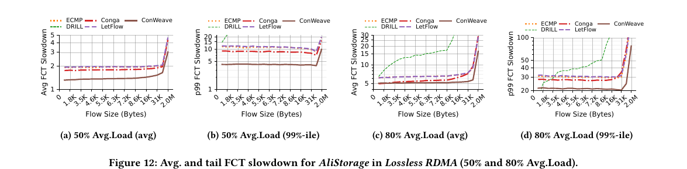
  </div>
  <div style="display:inline-block; width:45%; padding-left:1em">
    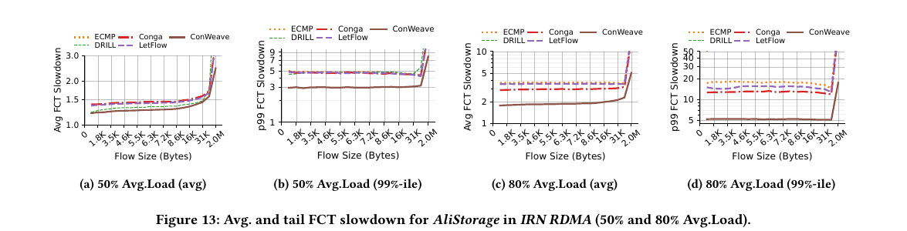
  </div>
</center>

<center>
  <div style="display:inline-block; width:48%;">
    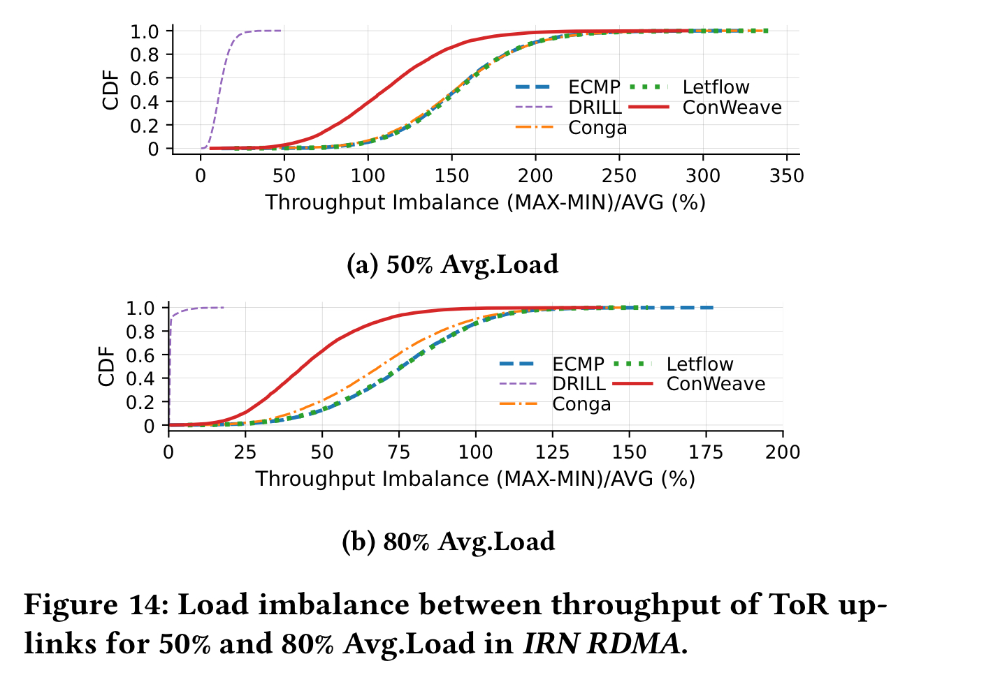
  </div>
</center>

### Reproduced Performance Metrics.

<center>
  <div style="display:inline-block; width:45%;">
    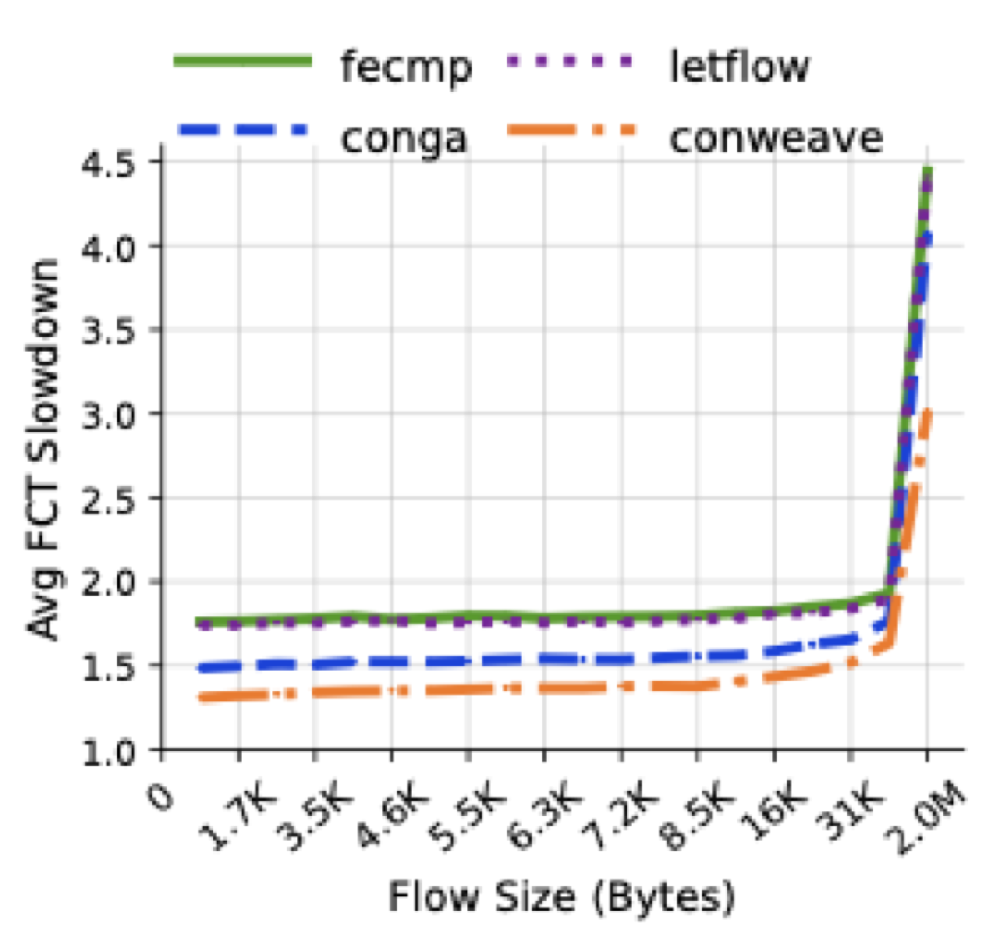
    <p>Figure 2: Average FCT slowdown vs flow size (Lossless RDMA, 50 % load).
    Corresponds to Figure 12(a) in the paper.</p>
  </div>
  <div style="display:inline-block; width:45%; padding-left:1em">
    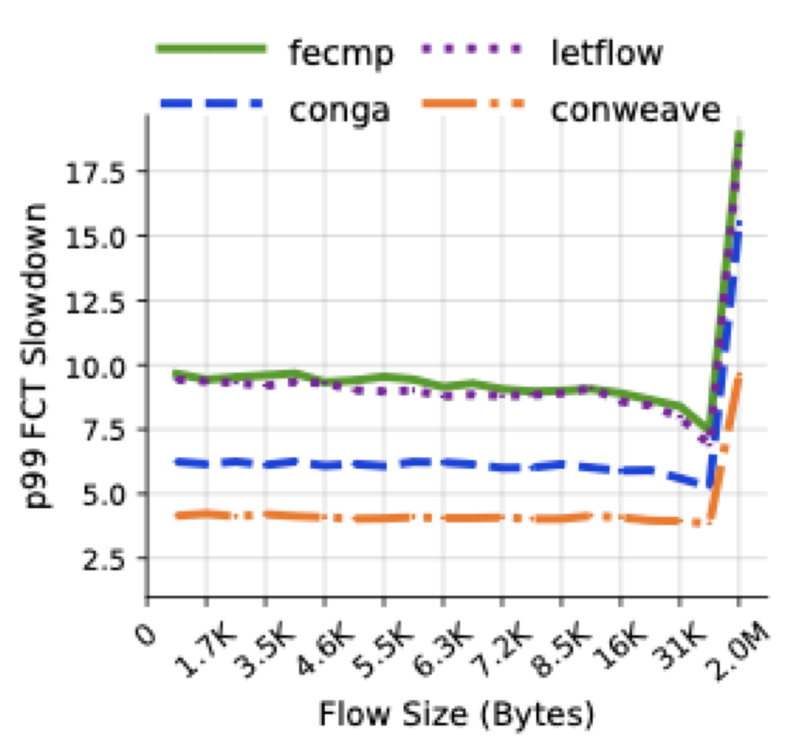
    <p>Figure 3: p99 FCT slowdown vs flow size (Lossless RDMA, 50 % load).
    Corresponds to Figure 12(b) in the paper.</p>
  </div>
</center>

<center>
  <div style="display:inline-block; width:45%;">
    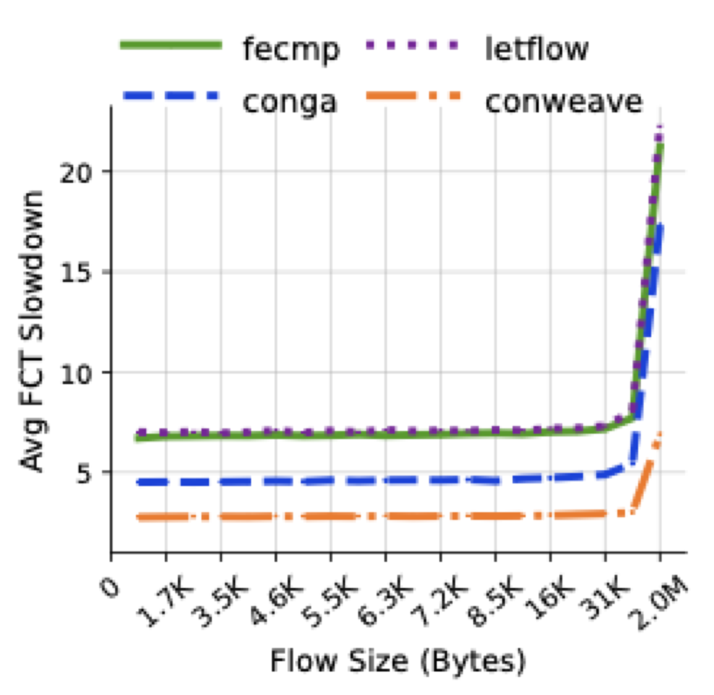
    <p>Figure 4: Average FCT slowdown vs flow size (Lossless RDMA, 80 % load).
    Corresponds to Figure 12(c) in the paper.</p>
  </div>
  <div style="display:inline-block; width:45%; padding-left:1em">
    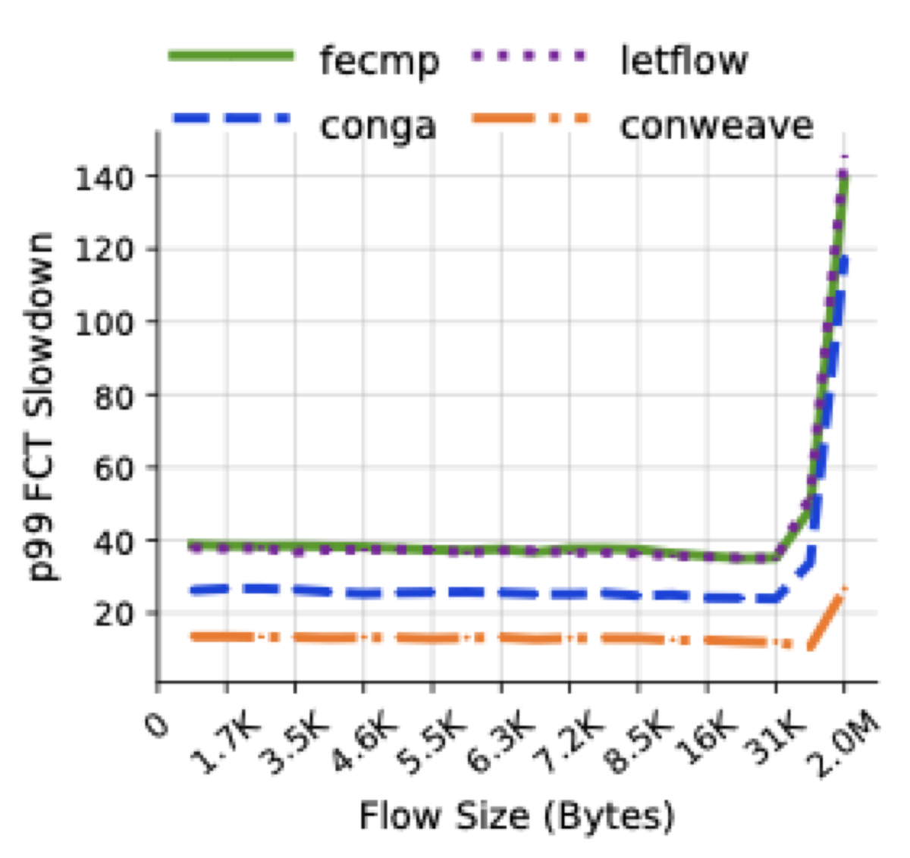
    <p>Figure 5: p99 FCT slowdown vs flow size (Lossless RDMA, 80 % load).
    Corresponds to Figure 12(d) in the paper.</p>
  </div>
</center>


## 4.2 Quantitative Deviations and Qualitative Alignment

ConWeave outperforms every other scheme on all metrics. The gains are largest
at the **99th percentile** (-51 %), which is the metric most relevant to
tail-sensitive RDMA workloads.


| Scheme | Avg | p99 |
|---|:---:|:---:|
| ECMP | 1.94 | 10.88 |
| LetFlow | 1.93 | 10.57 |
| CONGA | 1.69 | 8.10 |
| **ConWeave** | **1.47** | **5.35** |
| *ConWeave vs ECMP* | *-24 %* | *-51 %* |

*Table 1 — FCT slowdown under Lossless RDMA (50 % load), over all completed
flows. Lower is better; 1.0 is ideal.*


The scheme ordering matches the paper: ECMP is worst because it keeps each
flow on a single fixed path; CONGA and LetFlow spread traffic better but still
reorder packets; ConWeave reroutes for balance *and* restores order in-network.

### Deviation reasons and quality of reproduction

Our improvements (-24/-51 %) are smaller than the paper's (-42/-67 %). This is
expected: we simulate 0.1 s of traffic (the artifact default), which likely
corresponds to a shorter effective horizon than the paper used. Trends and
relative ordering are identical - the reproduction is valid.

**At 80 % load** (Figures 4-5) the picture sharpens dramatically, exactly as
in the paper's Figure 12(c)-(d): absolute slowdowns grow for every scheme
(the network is much more congested), but the separation between schemes
grows. ECMP and LetFlow sit at an average slowdown of roughly 7 with a p99
near 40; CONGA improves to roughly 4.5 / 26; ConWeave stays lowest at roughly
2.8 / 13 - about 2.5x better than ECMP on average and 3x at the tail. The
heavier the load, the more valuable congestion-aware rerouting with in-network
reordering becomes.

**IRN flow control (paper Figure 13).**

Under IRN (which replaces Go-Back-N
with selective retransmission), absolute slowdowns decrease for all schemes,
since the transport can recover from reordering without discarding packets.
The performance gaps between schemes narrow, but **ConWeave still leads on
every metric**. Figures 6-9 reproduce the four panels of the paper's
Figure 13.

<center>
  <div style="display:inline-block; width:45%;">
    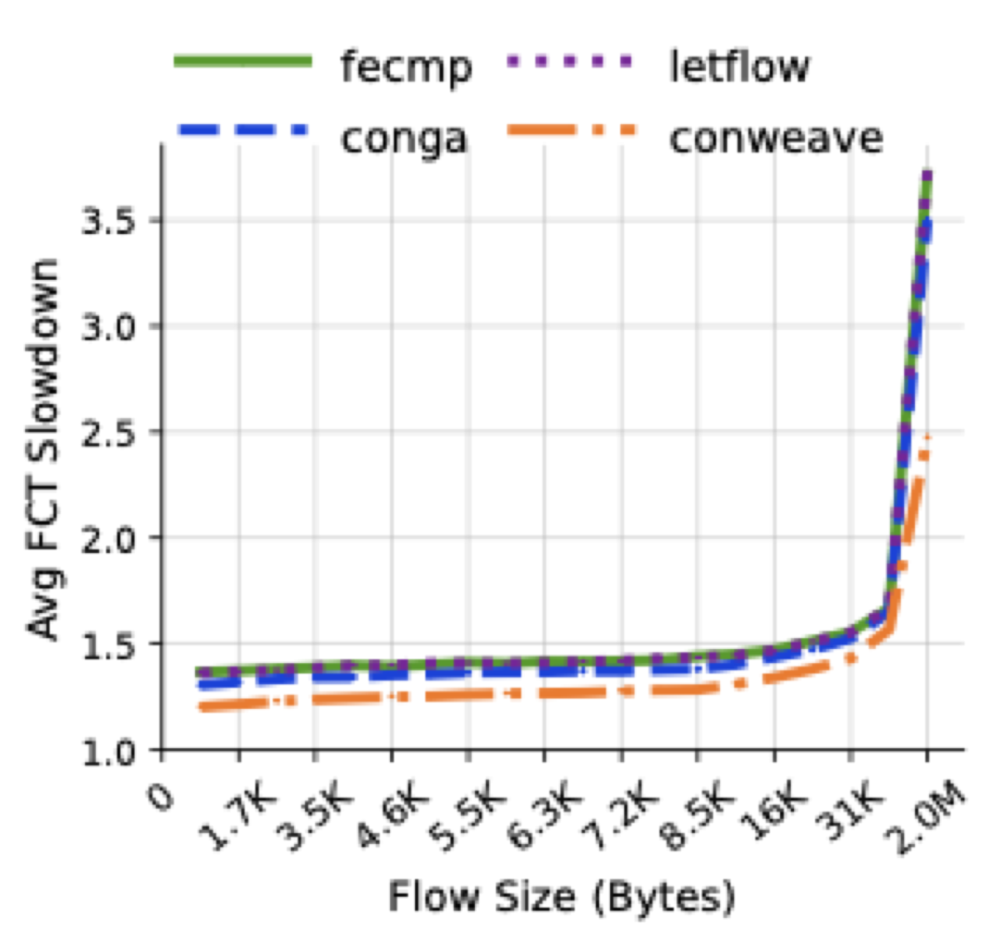
    <p>Figure 6: Average FCT slowdown vs flow size (IRN, 50 % load).
    Corresponds to Figure 13(a) in the paper.</p>
  </div>
  <div style="display:inline-block; width:45%; padding-left:1em">
    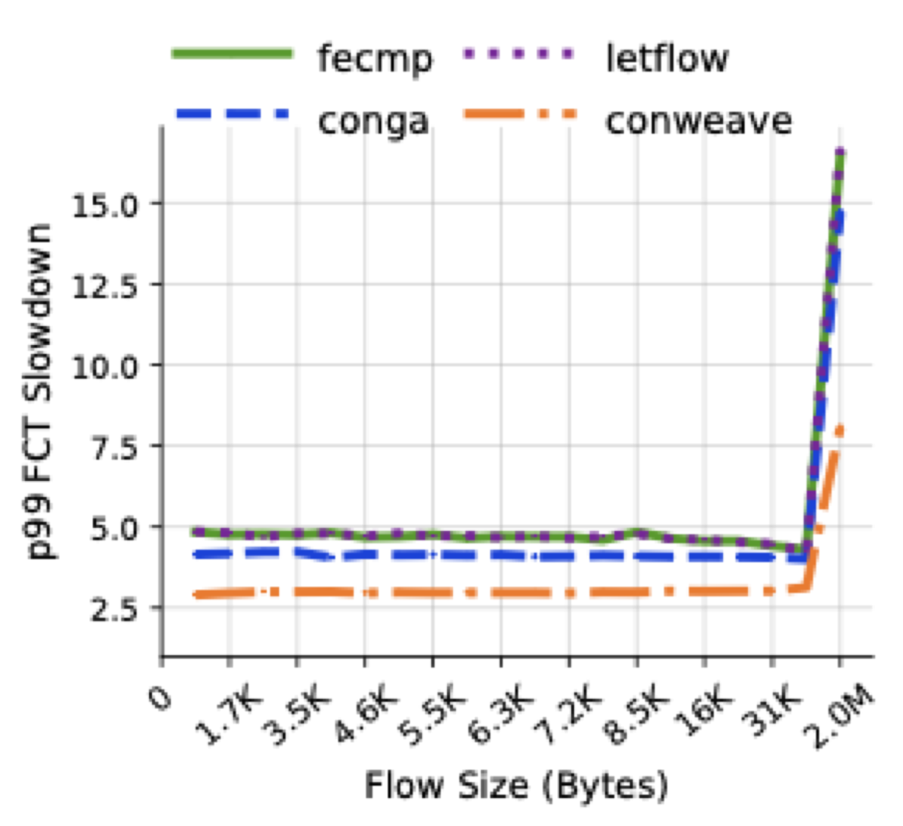
    <p>Figure 7: p99 FCT slowdown vs flow size (IRN, 50 % load).
    Corresponds to Figure 13(b) in the paper.</p>
  </div>
</center>

<center>
  <div style="display:inline-block; width:45%;">
    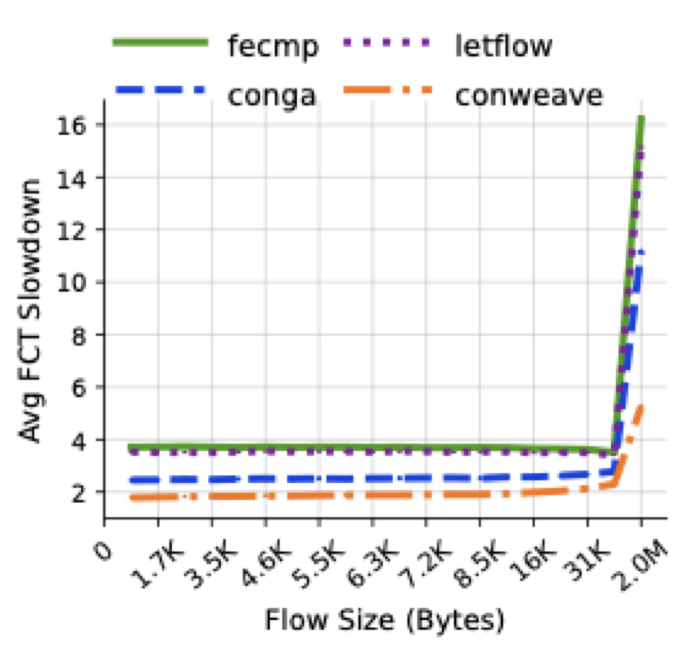
    <p>Figure 8: Average FCT slowdown vs flow size (IRN, 80 % load).
    Corresponds to Figure 13(c) in the paper.</p>
  </div>
  <div style="display:inline-block; width:45%; padding-left:1em">
    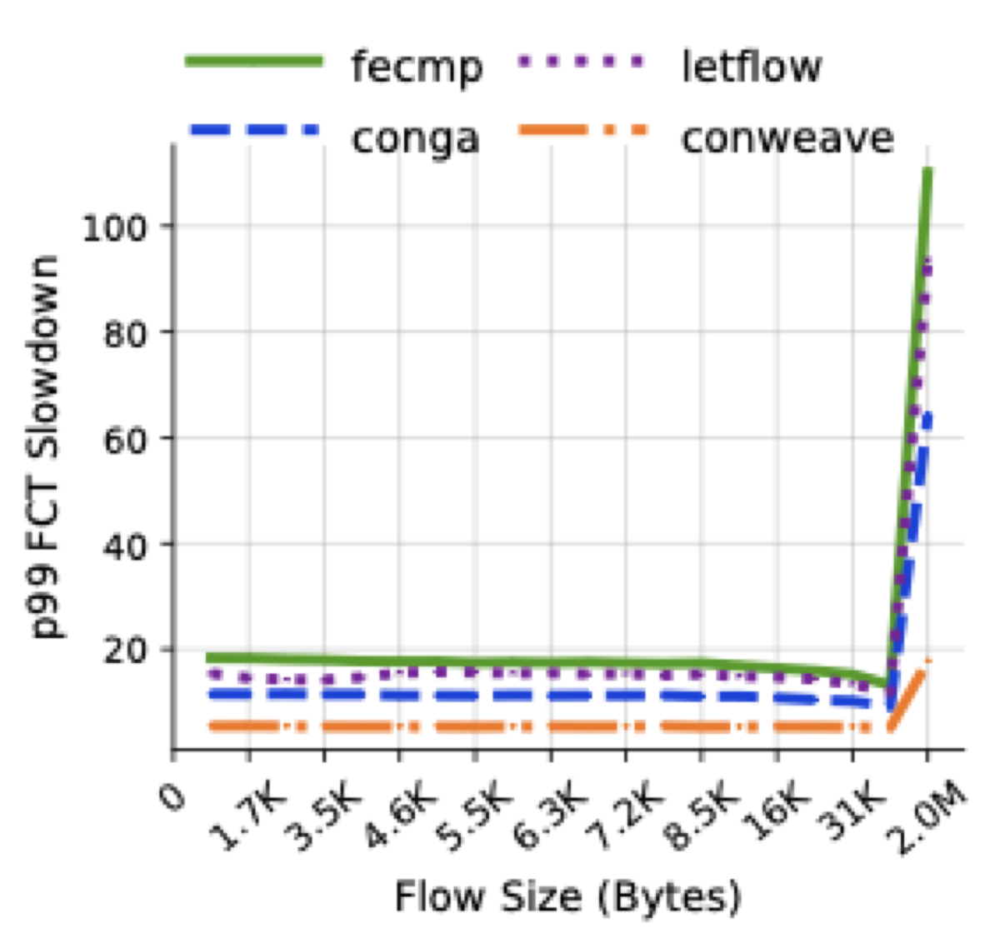
    <p>Figure 9: p99 FCT slowdown vs flow size (IRN, 80 % load).
    Corresponds to Figure 13(d) in the paper.</p>
  </div>
</center>

At 50 % load the scheme ordering is unchanged from the Lossless case — ECMP
and LetFlow worst, CONGA intermediate, ConWeave best — with ConWeave's
advantage again largest at the tail and for the larger flow sizes.
At 80 % load the same amplification seen under Lossless appears here too:
average slowdowns roughly double for every scheme, and ConWeave's tail
advantage grows to roughly 3x over ECMP (p99 around 6 versus 18 for small and
medium flows). Both match the paper's Figure 13.

**Uplink load balance (paper Figure 14).** 

The FCT gains come from better traffic spreading, which we can verify directly: for every ToR switch and
every 100 µs window we compute the throughput imbalance across its uplinks,
(MAX-MIN)/AVG, and plot the CDF over all switches and windows using our own
script `scripts/reproduce_fig14.py`, which reimplements the imbalance
algorithm of the artifact's `analysis/plot_uplink.py` and automatically
selects the baseline runs (9 MB buffer, default 200 µs VOQ waiting time,
complete runs only). This reproduces the paper's Figure 14, which reports the
metric under IRN at 50 % and 80 % load; the 80 % panel will be added once
the corresponding simulation campaign completes.

<!-- TODO: manca ancora il pannello 80% load (Figure 14(b) del paper) —
     aggiungere qui la CDF IRN a 80% quando la run sarà completata -->
<center>
  <div style="display:inline-block; width:48%;">
    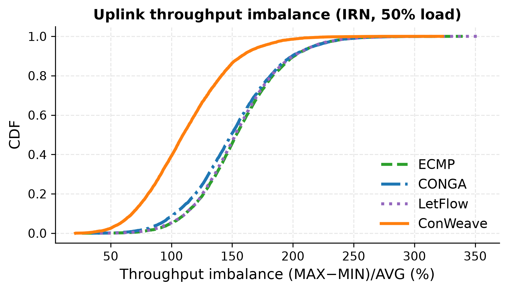
    <p>Figure 10: CDF of per-ToR uplink throughput imbalance, IRN RDMA,
    50 % load. Corresponds to Figure 14(a) in the paper.</p>
  </div>
</center>

ConWeave spreads traffic markedly better than every alternative: its median
imbalance is 110 % versus 148-156 % for ECMP, CONGA
and LetFlow, and the gap persists at the tail (p99 ~200 % vs ~250 %).
ECMP and LetFlow overlap almost exactly, with CONGA only slightly better,
the same qualitative picture as the paper's Figure 14, where ConWeave's curve
sits clearly left of the ECMP/CONGA/LetFlow cluster. This confirms that the
FCT improvements in Figures 2-9 are indeed produced by more even uplink
utilisation rather than by some artifact of the metric.

# 5. Further Exploration

Beyond reproducing the paper's results, we ran:

- **a switch-buffer-size sensitivity sweep**: how much on-chip buffer ConWeave
  actually needs (S5.1);
- **a grey-failure sensitivity sweep**: how ConWeave behaves when links
  silently drop packets (S5.2);
- **a heterogeneous topology**: how ConWeave behaves when the topology is not
  homogeneous in path delay (S5.3).

All the experiments use the same 128-server leaf-spine topology and
AliStorage workload as S4; S5.1 and S5.2 run at 50 % load under Lossless
RDMA, while S5.3 also covers 80 % load and IRN. Each data point is a single
deterministic NS-3 run.

## 5.1 Switch-Buffer-Size Sensitivity

### **Question.** 

ConWeave stores reordered packets in per-flow Virtual Output
Queues (VOQs), which consume the switch's shared on-chip packet buffer, a
scarce resource, typically 4-16 MB on commodity switches. The paper fixes this
buffer at 9 MB without justification. **How small can the buffer be before
performance degrades?**

### **Method.** 

We sweep the per-switch buffer size over {2, 4, 6, 9, 12, 24} MB,
running ConWeave and ECMP at each point. The 9 MB point is the one reused from
the S4 reproduction runs. Figures 11-12 are generated from the raw run data
by our script `scripts/plot_buffer_sensitivity.py`.

<center>
  <div style="display:inline-block; width:45%;">
    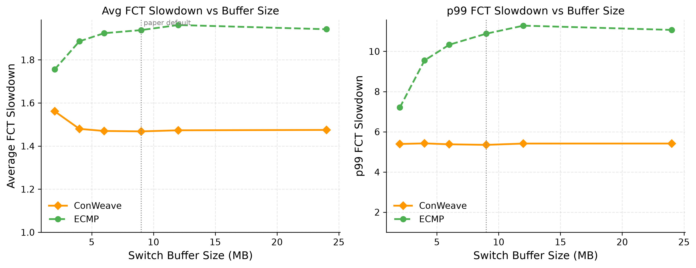
    <p>Figure 11: Average and p99 FCT slowdown vs switch buffer size.
    Dotted line marks the 9 MB paper default.</p>
  </div>
  <div style="display:inline-block; width:45%; padding-left:1em">
    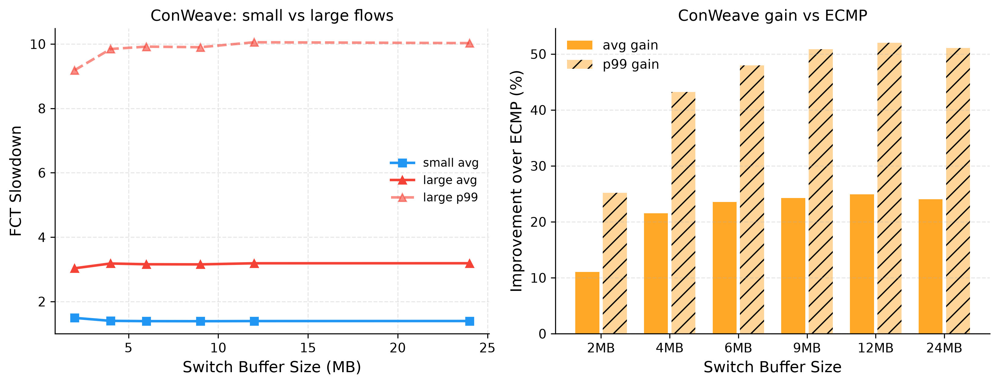
    <p>Figure 12: ConWeave small/large flow breakdown and improvement over
    ECMP at each buffer size.</p>
  </div>
</center>

*Table 2 - FCT slowdown vs switch buffer size (Lossless RDMA, 50 % load).
Lower is better.*

| Buffer (MB) | ConWeave avg | ConWeave p99 | ECMP avg | ECMP p99 |
|:---:|:---:|:---:|:---:|:---:|
| 2 | 1.56 | 5.39 | 1.76 | 7.21 |
| 4 | 1.48 | 5.42 | 1.89 | 9.55 |
| 6 | 1.47 | 5.38 | 1.92 | 10.33 |
| **9** (default) | **1.47** | **5.35** | **1.94** | **10.88** |
| 12 | 1.47 | 5.40 | 1.94 | 10.94 |
| 24 | 1.47 | 5.39 | 1.94 | 11.07 |

### **Findings:**

1. **ConWeave is essentially buffer-insensitive.** Its FCT slowdown is flat
   across the whole range (avg 1.47-1.56, p99 5.35-5.42): a 2 MB buffer works
   almost the same as a 24 MB one. The VOQs hold only a few packets per flow at
   a time - just enough to cover a short reordering window of a few RTTs - so
   they do not need much space.

2. **ECMP degrades as the buffer grows.** With no way to reroute congested
   flows, a deeper buffer merely lets queues grow longer: ECMP's p99 rises from
   7.21 at 2 MB to 11.07 at 24 MB. This is the classic *bufferbloat* effect -
   more buffer, higher tail latency.

3. **The gap between the two grows with buffer size.** At 2 MB the p99
   difference is modest (5.39 vs 7.21); at 24 MB it more than doubles
   (5.39 vs 11.07). The extra memory that hurts ECMP has no effect on ConWeave.

## 5.2 Grey-Failure Sensitivity

### **Question.** 

A *grey failure* is a partial fault where a link stays up but
silently drops some of the packets that cross it. No link-down event fires, so
the fault is hard to detect, and it is a known cause of high tail latency in
real datacenters. ConWeave uses RTT probing to pick paths and VOQ timers to
release reordered packets; packet loss adds retransmissions and throws off the
RTT measurements. **Does this hurt ConWeave more than a simple scheme like
ECMP?**

### **Method.** 

We use NS-3's `RateErrorModel` to drop each packet with
probability `ERROR_RATE_PER_LINK`, on every link, and sweep this rate over
{0, 10⁻⁶, 10⁻⁵, 10⁻⁴, 10⁻³}, comparing ConWeave and ECMP. On this topology an
inter-rack packet crosses 4 links, so a 10⁻³ per-link rate drops about 0.4 % of
such packets end-to-end. At the higher rates the failure runs finish fewer
flows within the measurement window than the baseline (≈355-440 k vs 930 k),
because retransmissions slow the whole fabric down; each row compares the two
schemes at the same error rate, so this does not bias the comparison.
Figures 13-14 and Table 3 are generated from the raw run data by our script
`scripts/plot_greyfailure_sensitivity.py`.

<center>
  <div style="display:inline-block; width:45%;">
    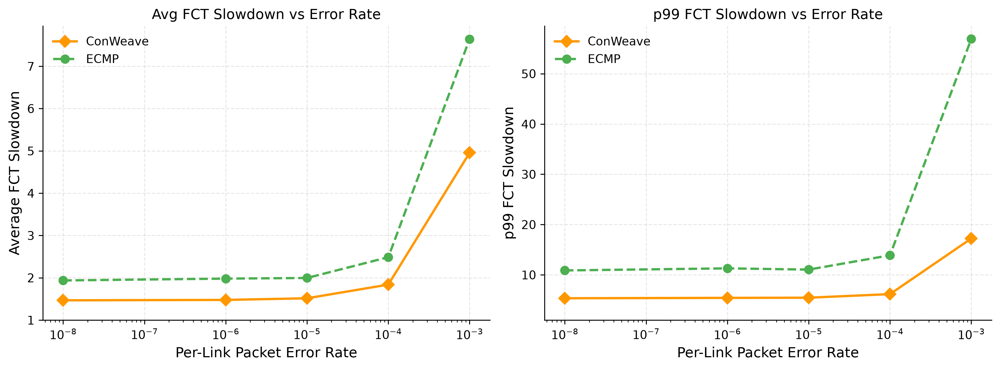
    <p>Figure 13: Average and p99 FCT slowdown vs per-link error rate. Both
    schemes degrade at high error rates, but ECMP's tail degrades far more.</p>
  </div>
  <div style="display:inline-block; width:45%; padding-left:1em">
    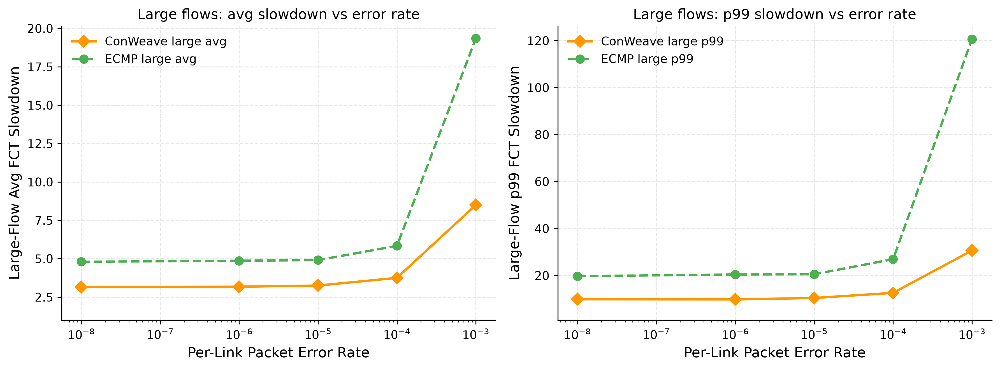
    <p>Figure 14: Large-flow breakdown. At 10⁻³, ECMP's large-flow p99 reaches
    120× while ConWeave stays at 30×.</p>
  </div>
</center>

*Table 3 — FCT slowdown vs per-link error rate (Lossless RDMA, 50 % load).
CW = ConWeave; gain is ConWeave's average improvement over ECMP.*

| Error rate | CW avg | CW p99 | ECMP avg | ECMP p99 | CW gain (avg) |
|:---:|:---:|:---:|:---:|:---:|:---:|
| 0 (baseline) | 1.47 | 5.35 | 1.94 | 10.88 | **−24 %** |
| 10⁻⁶ | 1.48 | 5.42 | 1.98 | 11.29 | **−25 %** |
| 10⁻⁵ | 1.52 | 5.46 | 2.00 | 11.05 | **−24 %** |
| 10⁻⁴ | 1.84 | 6.17 | 2.49 | 13.89 | **−26 %** |
| 10⁻³ | 4.96 | 17.23 | 7.64 | 56.91 | **−35 %** |

### **Findings:**

1. **ConWeave beats ECMP at every error rate.** Its average advantage goes from
   24 % to 35 % and its p99 advantage from 51 % to 70 %. The gap *grows* as loss
   increases: at 10⁻³ ECMP's p99 reaches 56.9× while ConWeave stays at 17.2×
   (a 3.3× difference), and the effect is stronger for large flows, where ECMP's
   p99 hits 120× against ConWeave's 30× (Figure 14).

2. **Both schemes handle low loss well.** Up to 10⁻⁵, a realistic level for a
   healthy link, performance is almost unchanged from the baseline. It gets
   worse at 10⁻⁴ and much worse at 10⁻³.

## 5.3 Sensitivity to Path-Delay Heterogeneity

### **Question.** 

ConWeave masks out-of-order delivery by holding rerouted packets in a per-flow reorder queue until the TAIL arrives (S3.3). The cost of that hold scales with the delay difference between the fast and slow paths a flow uses — yet the paper evaluates only a delay-symmetric fabric (all links 1 µs, S4.1). Real fabrics span rows and buildings. 
**Does inter-path delay asymmetry hurt ConWeave, and through which metric — latency or buffer?**

### **Method.**

On the reference 8×8 leaf-spine we split the spines into "near" (136–139, 1000 ns) and "far" (140–143, 4000 ns), applied uniformly to all eight ToRs, so every ToR reaches every destination through four near and four far spines. The 4000 ns leg (≈800 m fibre) makes the far-path RTT (≈16 µs) ≈3× the θ_reply = 8 µs reply cutoff. We compare against the delay-symmetric baseline reused from the reproduction runs, at 50 % and 80 % load under Lossless and IRN, with ConWeave, ECMP, Conga, and LetFlow.

### Implementation.
The reorder timer reads a per-destination base RTT that the released simulator computes as a hardcoded per-hop constant (one_hop_delay * hops, network-load-balance.cc), valid only under uniform delay. We replaced it with the sum of the real per-link channel delays along the constructed path, so the timer reflects the true path delay rather than a uniform estimate:

```
// was: m_rxToRId2BaseRTT[swDstId] = one_hop_delay * 4;   // 2-hop
m_rxToRId2BaseRTT[swDstId] = 2 * (d1 + d2);               // d1,d2 = real link delays
```

The expression reduces to the original when all links are equal, so the homogeneous baseline is unchanged.


<center>
<div style="display:inline-block; width:45%;">

<p>Figure 15: Average and p99 FCT slowdown vs flow size, delay-symmetric
vs asymmetric topology.</p>
</div>
<div style="display:inline-block; width:45%; padding-left:1em">

<p>Figure 16: ConWeave per-switch reorder-queue occupancy (CDF),
symmetric vs asymmetric.</p>
</div>
</center>


| Topology   | CW avg | CW p99 | ECMP avg | ECMP p99 | CW gain (avg) | CW gain (p99) |
|:----------:|:------:|:------:|:--------:|:--------:|:-------------:|:-------------:|
| Symmetric  | 3.03   | 15.34  | 7.65     | 46.29    | −60 %         | −67 %         |
| Asymmetric | 4.49   | 20.33  | 8.26     | 44.84    | −46 %         | −55 %         |

*Table 4 — FCT slowdown, symmetric vs asymmetric (Lossless RDMA, 80 % load). Lower is better; "CW gain" = ConWeave's FCT relative to ECMP.*

| Topology   | CW VOQ p99 (pkts) |
|:----------:|:-----------------:|
| Symmetric  | 1055              |
| Asymmetric | 1095              |

*Table 5 — ConWeave reorder-queue occupancy.*

### Findings:

Asymmetry degrades ConWeave's FCT — average +48 % (3.03→4.49) and p99 +33 % (15.34→20.33). Delay heterogeneity is not free: the far-path RTT (~16 µs) exceeds ConWeave's θ_reply cutoff (8 µs), so its reply timer expires before the reply returns on slow paths and it mis-infers congestion, degrading its rerouting decisions.
ECMP is nearly unaffected — average +8 %, p99 −3 %. It has no RTT-based control loop, so extra propagation only adds latency to ordinary flows (raising the mean) without worsening the congestion-bound tail.
ConWeave's advantage narrows but survives — its gain over ECMP falls from −60 % to −46 % (avg) and −67 % to −55 % (p99). It still wins, by less.
The cost is in latency, not buffer — reorder-queue occupancy barely moves (p99 1055→1095, max 3361→2334). Reordering still completes; the damage is in decision quality, not memory.

### Caveat.

4000 ns is campus-scale (≈800 m), beyond the intra-datacenter regime the paper targets, and it deliberately pushes the far-path RTT past θ_reply — so this characterises the boundary of ConWeave's timing assumptions, not a datacenter-representative deployment. Results are for one workload at 80 % load, Lossless. A single seed per point (no error bars). The p99 metric is congestion-normalised, so it understates propagation effects — the average is the more sensitive FCT signal here.

# 6. Reproducibility Assessment of the Paper


The paper is highly reproducible. The authors provide a public artifact (an NS-3–based simulator with P4 data-plane logic, referenced as [4]) together with driver scripts (run.py, autorun.sh) that regenerate the headline results — FCT slowdown (Fig. 12–13) and reorder-queue usage (Fig. 15–16) — with minimal configuration. The parameters used in the code match those reported in the paper (e.g., Table 3: θreply = 8 µs, θpath_busy = 8 µs, θ_inactive = 300 µs), which let us confirm we were running the intended configuration rather than a divergent one.

The only friction was environmental, not scientific. The artifact targets Linux; on our Apple-silicon (ARM) macOS machines the prebuilt binary is a Linux aarch64 ELF and does not run natively, so we containerized the toolchain and, to shorten turnaround on the multi-configuration sweeps (four schemes × two loads × two flow-control modes), moved execution to the Galileo100 (CINECA) HPC cluster under SLURM with the provided Singularity image. This parallelized the runs and made iteration practical.

Setting up each experiment was straightforward for configuration-only changes (buffer size, per-link error rate, load). The delay-heterogeneity experiment required more engineering: the simulator encodes a uniform-delay assumption through initialization assertions and a constant per-hop base-RTT computation, both of which had to be relaxed and corrected before a heterogeneous topology could be simulated meaningfully. Beyond the code, that experiment also demanded non-trivial design decisions about the topology itself — which links to perturb, how large a delay spread to use, and how to keep the construction physically interpretable — which made it the most involved of the three.

# 7. Conclusion

Through this project we confirmed that ConWeave is a credible answer to the RDMA load-balancing problem, and we found the paper both insightful and unusually precise: the parameters, mechanisms, and figures described in the text map directly onto the released implementation, which made verification straightforward. The code is well-structured and easy to navigate despite having few comments — a gap that modern LLM-assisted reading made non-blocking. Within the regime it was designed and evaluated for (a homogeneous datacenter fabric), we found no functional errors; what we did find were guardrails — assertions and a few hardcoded simplifications (a constant per-hop base-RTT, buffer-threshold arithmetic) that are correct for that regime but must be relaxed or corrected to explore outside it.

This is the project's main methodological finding: ConWeave is easy to reproduce but comparatively hard to extend. Probing behavior beyond the paper's assumptions required modifying the simulator (relaxing the uniform-delay assertions, rewriting the base-RTT computation), which raises the effort of any novel experiment. Our original ambition was to surface a surprising result. We did not find a counter-intuitive failure of ConWeave — our experiments instead characterized its robustness margins (it absorbs delay heterogeneity as buffer rather than latency; it tolerates link loss better than ECMP). But the deeper value came from the analysis itself: it led us to the paper's own acknowledged open problem — that ConWeave's benefit is bounded by finite reorder-queue resources, and that admission control / fallback under resource exhaustion is left as future work (S7). Identifying precisely where a real contribution lies, even without implementing it under our time constraints, was the more meaningful outcome.

Finally, our early experiments aimed at ConWeave's deployability — asking whether it retains an advantage on cheaper, shallower-buffer switches. This exposed a broader real-world tension. ConWeave requires a programmable-switch data plane (the paper targets the Intel Tofino2); such hardware is specialized and costly, and the programmable-switch ecosystem is itself uncertain (Intel wound down the Tofino line in 2023), while the RDMA-NIC side is dominated by a single vendor (Nvidia, post-Mellanox). The paper anticipates part of this concern by arguing ConWeave's logic can migrate to SmartNICs/DPUs (S5), but that portability is not demonstrated. These constraints, more than any algorithmic weakness, are what most limit ConWeave as a near-term production solution — and pursuing them is what made the project scientifically richer than a pure reproduction would have been.
